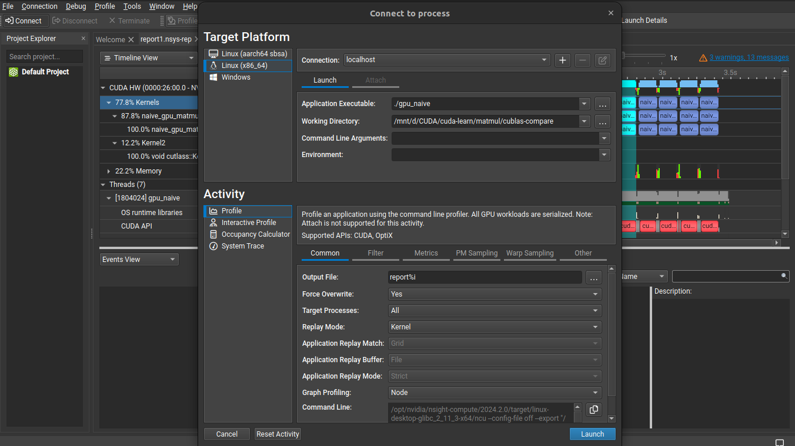
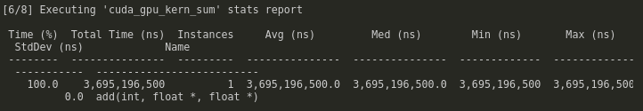

# How to Profile your CUDA kernels

## Follow along
1. 
```bash
nvcc -o 00 00\ nvtx_matmul.cu -lnvToolsExt
nsys profile --stats=true ./00
```

> for these two, you'd open `ncu` on linux and drag and drop the .nsys-rep file into the left sidebar.
> the .sqlite file can be plugged directly into sqlite DBs for more customized analysis
2. 
```bash
nvcc -o 01 01_naive_matmul.cu`
nsys profile --stats=true ./01
```

3. 
```bash
nvcc -o 02 02_tiled_matmul.cu
nsys profile --stats=true ./02
```

## CLI tools
- some cli tools to visualize GPU resource usage & utilization
- `nvitop`
- `nvidia-smi` or `watch -n 0.1 nvidia-smi`


# Nsight systems & compute
- nvprof is deprecated so we will be using `nsys` and `ncu` instead
- Nsight systems & compute ⇒ `nsys profile --stats=true ./main `

- Unless you have a specific profiling goal, the suggested profiling strategy is starting with Nsight Systems to determine system bottlenecks and identifying kernels that affect performance the most. On a second step, you can use Nsight Compute to profile the identified kernels and find ways to optimize them.
- https://stackoverflow.com/questions/76291956/nsys-cli-profiling-guidance
- if you already have the `.nsys-rep` file, run `nsys stats file.nsys-rep` for a more quantitative profile. for `.sqlite` run `nsys analyze file.sqlite` to give a more qualitative profile
- to see a detailed GUI of this, I can run `nsight-sys` ⇒ file ⇒ open ⇒ rep file
- `nsys` nsight systems is higher level; `ncu` nsight compute is lower level
- generate profiling files for python script `nsys profile --stats=true -o mlp python mlp.py`
- to profile w/ nsight systems GUI, find the kernels you need to optimize (ex: `ampere_sgemm`), open in event view, zoom to selected on timeline, analyze kernel w/ ncu by right clicking on timeline
- ncu may deny permissions ⇒ `code /etc/modprobe.d/nvidia.conf` and force change nvidia.conf by adding the line `options nvidia NVreg_RestrictProfilingToAdminUsers=0` then restarting your machine. This was the only issue I ran into so you may be on your own through some issues I don’t encounter in this course. check github, stackoverflow, nvidia developer forums, nvidia docs, pytorch docs if your issue is related to CUDA OR triton in pytorch, chatGPT or other LLMs to help navigate the space more easily (information won’t be as hard to process since its neatly organized)
    - src ⇒ 
- `compute-sanitizer ./main` for memory leaks
- kernel performance UI ⇒ ncu-ui (might have to `sudo apt install libxcb-cursor0`)

## Kernel Profiling
- [Nsight Compute Kernel Profiling](https://docs.nvidia.com/nsight-compute/ProfilingGuide/index.html)
- `ncu --kernel-name matrixMulKernelOptimized --launch-skip 0 --launch-count 1 --section Occupancy "./nvtx_matmul"`
- turns out nvidia profiling tools won't give you everything you need to optimize deep learning kernels: [Here](https://stackoverflow.com/questions/2204527/how-do-you-profile-optimize-cuda-kernels)

## Profiling Vector Addition
- when profiling the following 3 variants with a 32 (2^25) million element vector addition
    - basic without blocks OR threads
    - 
    - w/ threads
    - 
    - w/ threads and blocks
    - 
- originally from: https://developer.nvidia.com/blog/even-easier-introduction-cuda/


## NVTX `nvtx` profiling
```bash
# Compile the code
nvcc -o matmul matmul.cu -lnvToolsExt

# Run the program with Nsight Systems
nsys profile --stats=true ./matmul
```
- `nsys stats report.qdrep` to see the stats


## CUPTI
- allows you to build your own profiler tools
- The *CUDA Profiling Tools Interface* (CUPTI) enables the creation of profiling and tracing tools that target CUDA applications. CUPTI provides the following APIs: the *Activity API*, the *Callback API*, the *Event API*, the *Metric API*, the *Profiling API*, the *PC Sampling API*, the *SASS Metric API* and the *Checkpoint API*. Using these APIs, you can develop profiling tools that give insight into the CPU and GPU behavior of CUDA applications. CUPTI is delivered as a dynamic library on all platforms supported by CUDA.
- https://docs.nvidia.com/cupti/overview/overview.html
- Since CUPTI has a steeper learning curve, we are keeping it simple with the other profiler tools in this course.