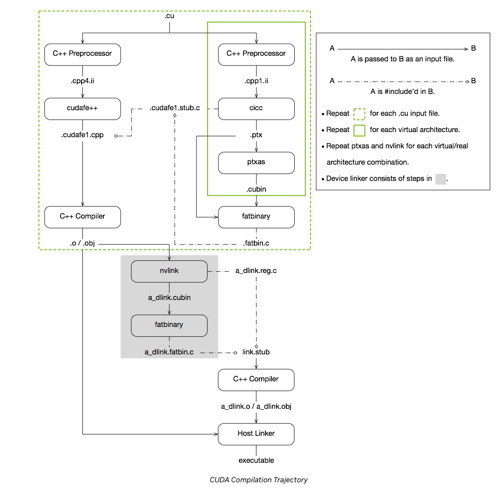
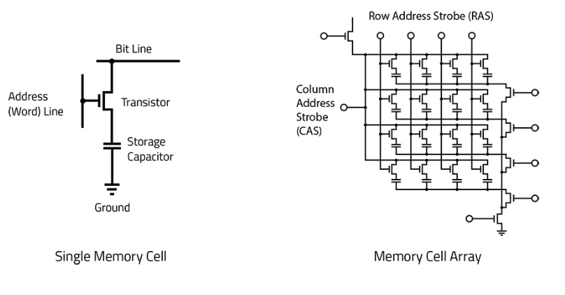
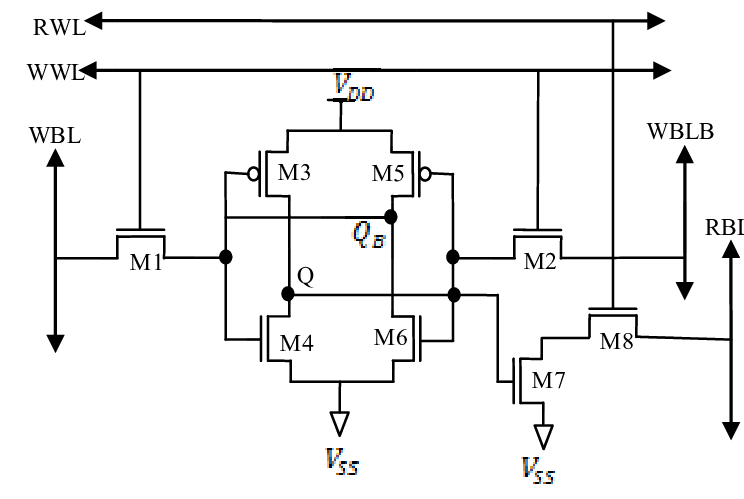

# Extras

## CUDA Compiler

## How does CUDA handle conditional if/else logic?
- CUDA does not handle conditional if/else logic well. If you have a conditional statement in your kernel, the compiler will generate code for both branches and then use a predicated instruction to select the correct result. This can lead to a lot of wasted computation if the branches are long or if the condition is rarely met. It is generally a good idea to try to avoid conditional logic in your kernels if possible.
- If it is unavoidable, you can dig down to the PTX assembly code (`nvcc -ptx kernel.cu -o kernel`) and see how the compiler is handling it. Then you can look into the compute metrics of the instructions used and try to optimize it from there.
- Single thread going down a long nested if else statement will look more serialized and leave the other threads waiting for the next instruction while the single threads finishes. this is called **warp divergence** and is a common issue in CUDA programming when dealing with threads specifically within a warp.
- vector addition is fast because divergence isn’t possible, not a different possible way for instructions to carry out.

## Pros and Cons of Unified Memory
- Unified Memory is a feature in CUDA that allows you to allocate memory that is accessible from both the CPU (system DRAM) and the GPU. This can simplify memory management in your code, as you don't have to worry about copying data back and forth between the the RAM sticks and the GPU's memory.
- [Unified vs Explicit Memory in CUDA](https://github.com/lintenn/cudaAddVectors-explicit-vs-unified-memory)
- [Maximizing Unified Memory Performance](https://developer.nvidia.com/blog/maximizing-unified-memory-performance-cuda/)
- Prefetching is automatically taken care of by unified memory via **streams** (this is what is has lower latency in the github link above)
    - [CUDA streams - Lei Mao](https://leimao.github.io/blog/CUDA-Stream/)
    - [NVIDIA Docs](https://docs.nvidia.com/cuda/cuda-c-programming-guide/index.html#asynchronous-concurrent-execution)
    - Streams allow for overlapping data transfer (prefetching) with computation.
    - While one stream is executing a kernel, another stream can be transferring data for the next computation.
    - This technique is often called "double buffering" or "multi-buffering" when extended to more buffers.

## Memory Architectures
- DRAM/VRAM cells are the smallest unit of memory in a computer. They are made up of capacitors and transistors that store bits of data. The capacitors store the bits as electrical charges, and the transistors control the flow of electricity to read and write the data.
- 
- SRAM (shared memory) is a type of memory that is faster and more expensive than DRAM. It is used for cache memory in CPUs and GPUs because it can be accessed more quickly than DRAM. 
- Modern NVIDIA GPUs likely use 6T (six-transistor) or 8T SRAM cells for most on-chip memory.
6T cells are compact and offer good performance, while 8T cells can provide better stability and lower power consumption at the cost of larger area.
- 6T vs 8T SRAM cells in NVIDIA GPUs across different architectures and compute capabilities isn't publicly disclosed in detail. NVIDIA, like most semiconductor companies, keeps many of these low-level design choices proprietary.
- 
- 

## Dive deeper
- quantization -> fp32 -> fp16 -> int8
- tensor cores (wmma)
- sparsity -> [0, 0, 0, 0, -7, 0, 0, 0, 0, 0, 0, 0, 0, 0, 0, 0, 6]
- [CUDA by Example](https://edoras.sdsu.edu/~mthomas/docs/cuda/cuda_by_example.book.pdf)
- [Data-Parallel Distributed Training of Deep Learning Models](https://siboehm.com/articles/22/data-parallel-training)
- [mnist-cudnn](https://github.com/haanjack/mnist-cudnn)
- [CUDA MODE](https://github.com/cuda-mode/lectures)
- [micrograd-cuda](https://github.com/mlecauchois/micrograd-cuda)
- [micrograd](https://github.com/karpathy/micrograd)
- [GPU puzzles](https://github.com/srush/GPU-Puzzles)